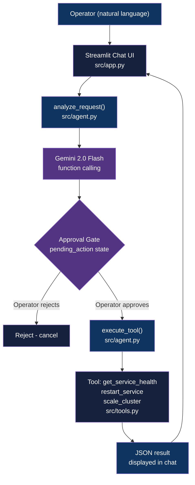
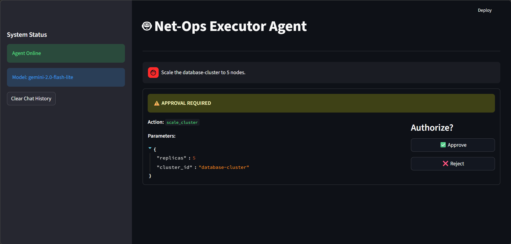
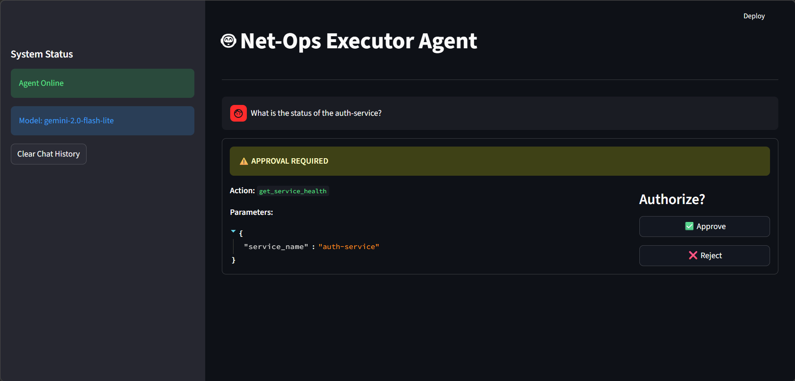

<div align="center">

# Net-Ops Agent

[](https://www.python.org/downloads/)
[](https://github.com/astral-sh/uv)
[](https://ai.google.dev/gemini-api/docs/models)
[](https://streamlit.io/)
[](LICENSE)

**Agentic network-ops assistant powered by Gemini 2.0 Flash with mandatory human approval before any action executes**

[Getting Started](#getting-started) | [Usage](#usage) | [Architecture](#architecture)

</div>

---

## Table of Contents

- [The Problem](#the-problem)
- [Features](#features)
- [Tech Stack](#tech-stack)
- [Architecture](#architecture)
- [Demo](#demo)
- [Getting Started](#getting-started)
  - [Prerequisites](#prerequisites)
  - [Installation](#installation)
  - [Configuration](#configuration)
- [Usage](#usage)
- [Architectural Decisions](#architectural-decisions)
- [Project Structure](#project-structure)
- [Testing](#testing)
- [Known Issues](#known-issues)
- [Related Projects](#related-projects)
- [License](#license)
- [Author](#author)

## The Problem

### The "Rogue Agent" Risk in Network Operations

Enterprises hesitate to put GenAI on the execution path because a hallucinated command (`delete database`, `scale to 0`) runs without recourse. Conversational chatbots give advice safely but cannot take controlled action.

### The Solution

Net-Ops Agent enforces a Reasoning-Action Separation pattern: Gemini 2.0 Flash selects the tool and parameters, then execution is blocked at a persistent approval gate until a human operator explicitly authorizes the call. The LLM never touches infrastructure directly.

## Features

- **Human-in-the-loop gate** - every tool call surfaces an Approve/Reject widget before execution; no bypass path exists
- **Deterministic toolbelt** - the agent selects from three pre-vetted functions (`get_service_health`, `restart_service`, `scale_cluster`) rather than generating arbitrary code
- **Natural language parameter inference** - phrases like "restart immediately" correctly map to `force=True` without explicit flag syntax
- **Persistent pending state** - the approval widget survives network lag via Streamlit session state; no race condition between reasoning and execution phases
- **Graceful and force restart modes** - `restart_service` supports both graceful (1 s) and hard-kill (2 s) sequences with distinct confirmation display

## Tech Stack

| Component | Technology |
|-----------|------------|
| Language | Python 3.12+ |
| Package manager | uv |
| LLM | Gemini 2.0 Flash (`gemini-2.0-flash-lite`) |
| LLM SDK | google-generativeai (native function calling) |
| Frontend | Streamlit (session state, chat UI) |
| Validation | Python type hints + Pydantic-compatible signatures |
| Testing | pytest + unittest.mock |

## Architecture


```mermaid
graph TD
    A["Operator (natural language)"]
    B["Streamlit Chat UI\nsrc/app.py"]
    C["analyze_request()\nsrc/agent.py"]
    D["Gemini 2.0 Flash\nfunction calling"]
    E{"Approval Gate\npending_action state"}
    F["Reject - cancel"]
    G["execute_tool()\nsrc/agent.py"]
    H["Tool: get_service_health\nrestart_service\nscale_cluster\nsrc/tools.py"]
    I["JSON result\ndisplayed in chat"]

    A --> B
    B --> C
    C --> D
    D --> E
    E -->|"Operator rejects"| F
    E -->|"Operator approves"| G
    G --> H
    H --> I
    I --> B

    style A fill:#0f3460,color:#fff
    style B fill:#16213e,color:#fff
    style C fill:#0f3460,color:#fff
    style D fill:#533483,color:#fff
    style E fill:#533483,color:#fff
    style F fill:#16213e,color:#fff
    style G fill:#0f3460,color:#fff
    style H fill:#16213e,color:#fff
    style I fill:#0f3460,color:#fff
```

## Demo

| Scenario | Screenshot |
|----------|------------|
| Scale cluster - agent identifies `scale_cluster` + replica count |  |
| Service health check - agent calls `get_service_health` |  |
| Force restart - agent infers `force=True` from "immediately" |  |

## Getting Started

### Prerequisites

- Python 3.12+
- [uv](https://docs.astral.sh/uv/) package manager
- Google Gemini API key ([get one here](https://aistudio.google.com/app/apikey))

### Installation

1. Clone the repository:
   ```bash
   git clone https://github.com/adityonugrohoid/net-ops-agent.git
   cd net-ops-agent
   ```

2. Install dependencies:
   ```bash
   uv sync
   ```

### Configuration

```bash
cp .env.example .env
```

Edit `.env` with your key:

<details>
<summary>Full configuration reference</summary>

```bash
# -- Required -------------------------------------------
GEMINI_API_KEY=your_gemini_api_key_here
```

</details>

## Usage

```bash
uv run streamlit run src/app.py
```

The Streamlit UI opens in your browser. Type a natural language command into the chat input, for example:

- `"Check health of payment-api"`
- `"Scale prod-cluster to 5 replicas"`
- `"Restart web-server immediately"`

The agent responds with a structured Approval Request showing the selected tool and inferred parameters. Click **Approve** to execute or **Reject** to cancel.

## Architectural Decisions

### 1. Deterministic function calling over free-form code generation

**Decision:** The agent is constrained to a fixed toolbelt of three Python functions registered via the Gemini function calling API. It cannot generate or execute arbitrary code.

**Reasoning:** Open-ended code generation (e.g., giving the LLM a bash shell) produces an unbounded action space. Restricting it to pre-vetted functions means the only executable operations are those a human engineer has reviewed and approved at design time, not at runtime.

### 2. Persistent pending-action state in Streamlit session state

**Decision:** The approval widget is rendered from `st.session_state.pending_action` rather than from a transient variable in the request/response cycle.

**Reasoning:** Operations are transactional. The system must pause reliably between the reasoning phase (LLM) and the execution phase (Python function). Session state persists across reruns and survives network latency, giving the operator a stable gate that does not disappear if the page flickers.

## Project Structure

```
net-ops-agent/
├── src/
│   ├── agent.py                   # analyze_request() and execute_tool() logic
│   ├── app.py                     # Streamlit UI, HITL approval gate
│   └── tools.py                   # get_service_health, restart_service, scale_cluster
│
├── tests/
│   ├── test_agent.py              # Unit tests for agent request analysis + tool dispatch
│   └── test_tools.py              # Unit tests for tool functions
│
├── assets/                        # UI screenshots (approval gate demos)
├── .env.example                   # Configuration template
├── pyproject.toml                 # uv project manifest
└── main.py                        # Stub entry point
```

## Testing

```bash
# Install dev dependencies
uv sync --extra dev

# Run all tests
uv run pytest tests/ -v

# Run a specific module
uv run pytest tests/test_agent.py -v
```

The test suite covers tool call inference (including parameter inference from natural language), text fallback responses, error handling, and all three tool functions with valid and invalid arguments.

## Known Issues

| Issue | Impact | Workaround |
|-------|--------|------------|
| `google-generativeai` SDK deprecated; migration to `google-genai` required by 2026-06-24 | Medium - current code works until cutoff date | Follow the [official migration guide](https://ai.google.dev/gemini-api/docs/migrate) before the deadline |

## Related Projects

| Project | Description |
|---------|-------------|
| [incident-commander](https://github.com/adityonugrohoid/incident-commander) | Async log analyzer batching noisy error streams into structured incident reports (Gemini 2.0 Flash Lite) |
| [noc-oracle](https://github.com/adityonugrohoid/noc-oracle) | Runbook RAG engine mapping error codes to verified procedures (hybrid search + Gemini 2.0 Flash) |

## License

This project is licensed under the [MIT License](LICENSE).

## Author

**Adityo Nugroho** ([@adityonugrohoid](https://github.com/adityonugrohoid))
