# Net-Ops Executor: Agentic AI with Safety Guardrails


**"The Hands" of the Operation.** An autonomous agent that translates natural language commands into safe, deterministic Python function calls using a Human-in-the-Loop (HITL) approval workflow.

> 🔗 **Part of the TRINITY Project** | An end-to-end AI-powered Network Operations Suite

## ⚡ The Problem: The "Rogue Agent" Fear
Enterprises are hesitant to deploy GenAI for operations because they fear an LLM will hallucinate a command like `delete database`. Chatbots are useful for *advice*, but dangerous for *action*.

## 🛡️ The Solution
**Net-Ops Executor** uses a **Reasoning-Action Separation** pattern.
1.  **Reasoning:** The LLM decides *which* tool to use (e.g., `restart_service`).
2.  **Interception:** The system "pauses" execution and presents a structured Approval Request to the human operator.
3.  **Action:** The Python function executes *only* after explicit human authorization.

## 📸 Interface Modes

### 1. Scaling Resources
The agent identifies the `scale_cluster` tool and parameters.


### 2. Service Health Check
The agent calls `get_service_health` to retrieve status.


### 3. Force Restart (Advanced Logic)
The agent infers `force=True` from natural language ("immediately").


## System Architecture

```mermaid
graph LR
    subgraph "Interaction Layer"
        USER[User] -- "Natural Language" --> UI[Streamlit Interface]
    end

    subgraph "Agent Core"
        LLM[Gemini 2.0 Flash]
        STATE[Session State]
    end

    subgraph "Safety & Execution"
        GATE{Approval Gate}
        STOP[Cancel]
        RUN[Python Runtime]
    end
    
    UI -- "Context + Tools" --> LLM
    LLM -- "ToolCall Request" --> STATE
    STATE -- "Pending Action" --> GATE
    GATE -- "❌ Reject" --> STOP
    GATE -- "✅ Approve" --> RUN
    RUN -- "JSON Result" --> UI
    
    style GATE fill:#ff9900,stroke:#333,stroke-width:2px
```



## Architectural Decisions

### 1. Execution: Deterministic Tool Use
* **Decision:** Replaced open-ended code generation with strict **Function Calling**.
* **Reasoning:** We do not want the LLM to invent commands (e.g., `sudo rm -rf`). By forcing it to choose from a pre-defined "Toolbelt" of Python functions, we ensure that the only actions possible are those we have explicitly coded and vetted.

### 2. Safety: State Management & Interception
* **Decision:** Implemented a persistent "Pending Action" state in the UI.
* **Reasoning:** Operations are transactional. The system must "pause" effectively between the **Reasoning Phase** (LLM) and the **Execution Phase** (Python). Storing this state allows the UI to present a stable "Approve/Reject" gate that persists even if the network lags.

## Tech Stack
* **Runtime:** Python 3.12+ (uv)
* **LLM:** Google Gemini 2.0 Flash
* **Architecture:** Native Function Calling (No heavy agent frameworks)
* **Validation:** Pydantic / Type Hints
* **Frontend:** Streamlit (Session State Management)

## ⚠️ Known Issues
**Google Generative AI SDK Deprecation:**  
The `google-generativeai` package is deprecated and support ended as of January 2025. Migration to `google-genai` is required before **June 24, 2026**. The current implementation works but will need updating. See [migration guide](https://ai.google.dev/gemini-api/docs/migrate) for details.

## Quick Start

```bash
# 1. Install dependencies
uv sync

# 2. Setup Secrets
cp .env.example .env
# Edit .env and add your GEMINI_API_KEY=...

# 3. Run the Dashboard
uv run streamlit run src/app.py
```

## Testing

```bash
# Install development dependencies
uv sync --extra dev

# Run all tests
pytest tests/

# Run with verbose output
pytest tests/ -v
```

## Notable Code

This repository demonstrates sophisticated agentic AI safety patterns. See [NOTABLE_CODE.md](NOTABLE_CODE.md) for detailed code examples highlighting:

- Reasoning-action separation implementation
- Approval gate with persistent session state
- Deterministic function calling pattern

## License

This project is licensed under the MIT License - see the [LICENSE](LICENSE) file for details.

## Author

**Adityo Nugroho**  
- Portfolio: https://adityonugrohoid.github.io  
- GitHub: https://github.com/adityonugrohoid  
- LinkedIn: https://www.linkedin.com/in/adityonugrohoid/
